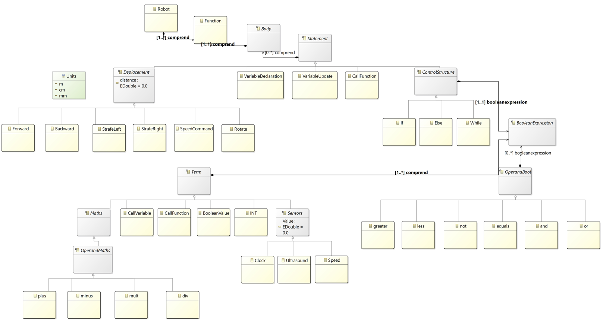

# Robot project - ASE

Developed by Quentin Legrand & Bastien Sauvat

## 💻 Presentation

For this project we developed ASE_Robot, a language to define the behavior of a small robot.
This DSL include modeling domain and the associated tooling , an interpretor and a compiler. 

## 🔨 Architecture

Here is the model we created and relied on four our DSL.
